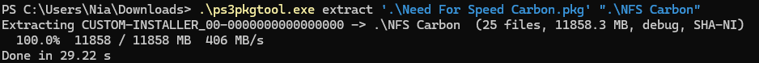
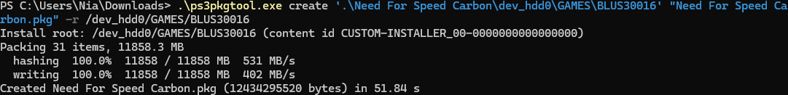

# ps3pkgtool

Fast command-line tool for PS3 `.pkg` files: extract, create, split and join.
One C file, no dependencies, runs on Windows, Linux and macOS.

Written as a faster, scriptable replacement for GUI extractors: decryption is
spread across all CPU cores and retail packages use AES-NI when the CPU has it.

> **Status:** the PC side (create → extract round trips, split → join) is covered
> by the test suite. Packages produced by `create` have **not yet been verified
> on a real console**. Try a small one before trusting it with a big game.

## Download

Grab a build from the [Releases](../../releases) page, or build it yourself:

```sh
# Linux / macOS
cc -O2 ps3pkgtool.c -o ps3pkgtool -lpthread

# Windows (mingw-w64)
gcc -O2 -static ps3pkgtool.c -o ps3pkgtool.exe -lshell32
```

`make test` runs the round-trip tests.

## Usage

```
ps3pkgtool info    <file.pkg>                    show header + metadata
ps3pkgtool list    <file.pkg>                    list contents
ps3pkgtool extract <file.pkg> [outdir] [-v] [-f] extract (retail or debug)
ps3pkgtool create  <dir> <out.pkg> [-c CONTENTID] [-t TYPE] [-r ROOT] [-s SIZE] [-f]
ps3pkgtool split   <file> [-s SIZE] [-f]         raw split into file.66600, .66601...
ps3pkgtool join    <file.66600> [out] [-f]       join the parts back
ps3pkgtool selftest                              check the crypto on this CPU
ps3pkgtool version                               print the version
```

### Overwriting

If an output file already exists, `extract`, `create`, `split` and `join` ask once before
overwriting. Pass `-f` to overwrite without asking (for scripts or when you leave it running).
With no console attached and no `-f`, the tool stops instead of waiting for an answer.

### Extract

```sh
ps3pkgtool extract game.pkg outdir
```

Works with retail (finalized) and debug/homebrew packages. "Custom installer"
packages store names like `../../../dev_hdd0/GAMES/...`; `list` shows them as
they are, `extract` drops the `..` parts so everything stays inside `outdir`
(you get `outdir/dev_hdd0/GAMES/...`).

### Create

Point it at the folder that has `PARAM.SFO` at its root, i.e. what will become
`/dev_hdd0/game/<TITLE_ID>/` on the console:

```sh
ps3pkgtool create MyGame out.pkg
ps3pkgtool create MyGame out.pkg -c UP0001-NPEB00000_00-0000000000000000
```

Without `-c` the content ID is built from `TITLE_ID` in `PARAM.SFO`.
Packages are debug-style (non finalized), same layout PSL1GHT produces.

**Custom install path** (`-r`): the folder's contents are installed to any path
instead of `/dev_hdd0/game/<TITLE_ID>/`, using the same `../../../` trick
custom installer packages use:

```sh
ps3pkgtool create BLUS30016 nfs.pkg -r /dev_hdd0/GAMES/BLUS30016
```

(In Git Bash / MSYS on Windows drop the leading slash, `-r dev_hdd0/GAMES/BLUS30016`,
or the shell rewrites it into a Windows path. PowerShell and cmd are fine either way.)

**Several installable packages** (`-s`): instead of one big package, write
`out_1p.pkg`, `out_2p.pkg`... of up to the given size. Each one is a complete
package holding a slice of the files; install them all, in any order.

```sh
ps3pkgtool create BLUS30016 nfs.pkg -r /dev_hdd0/GAMES/BLUS30016 -s 4000M
```

A package cannot hold part of a file, so if a single file is larger than the
part size `create -s` refuses to run, lists the offending files and writes
nothing. Use the raw split below for those.

### Split / join

```sh
ps3pkgtool split big.pkg            # big.pkg.66600, .66601, ...  (FAT32-safe by default)
ps3pkgtool split big.pkg -s 2G
ps3pkgtool join  big.pkg.66600      # back to big.pkg
```

This is a plain byte split, like archive volumes: the pieces are **not**
installable on their own and must be concatenated in order first (with `join`
on PC, or on the console by a separate homebrew).

## Performance notes

- Retail packages are AES-128-CTR; with AES-NI this is limited by your disk.
- Debug packages use a SHA-1 based keystream (two SHA-1 blocks per 16 bytes),
  which is inherently slower. It uses the SHA extensions (SHA-NI) when the CPU has them
  and scales with the number of cores.

### Real-world run

Need for Speed Carbon folder game (25 files, 11.86 GB) on a Ryzen 7 7730U, Windows 11,
debug package with SHA-NI:

| | Time | Throughput |
|---|---|---|
| `extract` | 29 s | ~406 MB/s |
| `create -r` | 52 s (hash pass + write pass) | ~402 MB/s |




(The `create` screenshot predates a display fix: it counted both passes in one bar, hence
the doubled MB figure. The package itself is 11.86 GB.)

## Limitations

- `create` only makes debug-style packages (no finalized/retail output).
- Files flagged as PSP content inside a PS3 package are handled but untested.
- No MSVC support; build with GCC or Clang.

## Credits

Format knowledge comes from public homebrew documentation and tools
(psdevwiki, PSL1GHT's `pkg.py`, RPCS3). No official SDK material was used.

## Releasing

Bump `VERSION` in `ps3pkgtool.c`, then run `release.bat` (Windows). It commits, pushes and
pushes a `v<VERSION>` tag; GitHub Actions builds the binaries and publishes the release.

## License

[MIT](LICENSE): do what you want with it, just keep the copyright notice.
